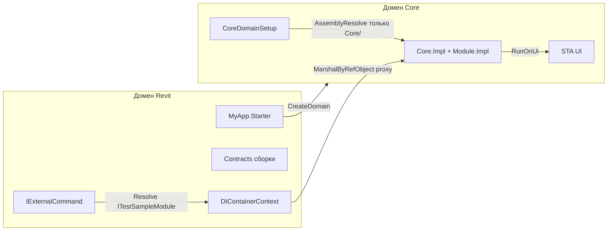

# MyApp — Revit Add-in с кросс-доменной архитектурой

## Статья посвященная проблеме

[Здесь](./post/Решение%20конфликтов%20зависимости%20в%20.NET%204.8%20—%20Cross%20Domain%20Interaction%20на%20примере%20плагина%20Autodesk%20Revit.md)

## О проекте

**MyApp** — плагин (add-in) для Autodesk Revit, демонстрирующий архитектуру с **двумя AppDomain** и изоляцией зависимостей.

Название репозитория отражает задачу: избежать конфликтов версий зависимостей (DepsConflict) за счёт выноса логики в отдельный домен приложения (CrossDomain).

Точка входа: [MyApp.Starter/MyAppExternalApplication.cs](MyApp.Starter/MyAppExternalApplication.cs) — `IExternalApplication` для Revit. При старте создаётся DI-контейнер, инициализируется домен Core, строится лента с кнопками (данные, Material, Metro, HandyControl, Excel, Hello).

## Структура решения

| Проект | Назначение |
|--------|------------|
| **MyApp.Starter** | Хост в процессе Revit. Ссылается только на сборки **Contracts**; на Impl — с `ReferenceOutputAssembly="false"` и `PrivateAssets="All"`, чтобы реализации не загружались в домен Revit. |
| **MyApp.Core.Contracts** | Интерфейсы, DTO, конфиг, Revit-команды Core. |
| **MyApp.Core.Impl** | Реализация Core-модуля, логгер, UI-runner. |
| **MyApp.Modules.TestModule.Contracts** | Контракты тестового модуля (интерфейсы, команды, ViewModel). |
| **MyApp.Modules.TestModule.Impl** | Реализация модуля с окнами (WPF, Material Design, Metro, HandyControl, Excel). |

Сборки Impl и их зависимости копируются в подкаталог **Core/** при сборке (MSBuild-цель `CopyCoreToOutput` в [MyApp.Starter/MyApp.Starter.csproj](MyApp.Starter/MyApp.Starter.csproj)). Домен Core загружает сборки только из этой папки.

## Архитектура: кросс-доменное взаимодействие

### Два домена

- **Домен Revit** — домен по умолчанию процесса; в нём загружаются Starter и сборки Contracts (в т.ч. классы команд Revit).
- **Домен Core** — создаётся в [OtherAppDomainManager.cs](MyApp.Core.Contracts/Domain/OtherAppDomainManager.cs) через `AppDomain.CreateDomain` с `ApplicationBase` и `PrivateBinPath`, равными папке **Core/**.

### Изоляция зависимостей

В домене Core первым создаётся [CoreDomainSetup](MyApp.Core.Contracts/Domain/CoreDomainSetup.cs) (`CreateInstanceFromAndUnwrap`), вызывается `SetResolveOnlyFromBasePath(corePath)` — подписка на `AssemblyResolve` загружает сборки только из папки Core. Так избегаются конфликты с версиями из папки Revit или других аддинов (например, Serilog, UI-библиотеки).

### Маркировка модулей

Классы, создаваемые в домене Core, помечаются атрибутом [OtherDomainImplementationAttribute](MyApp.Core.Contracts/OtherDomainImplementationAttribute.cs). `OtherAppDomainManager` находит их в Core.Impl и в сборках по паттерну `MyApp.Modules.*`, создаёт экземпляры через `CreateInstanceFromAndUnwrap`; в Revit в контейнер попадают **прокси** (MarshalByRefObject).

### Вызовы через границу

Команды Revit резолвят из `DIContainerContext` интерфейсы (`ITestSampleModule`, `ICoreModule`); вызовы уходят в домен Core по .NET Remoting. Данные через границу передаются сериализуемыми DTO (например, [WallsViewModel](MyApp.Modules.TestModule.Contracts/ViewModels/WallsViewModel.cs), [DeleteResult](MyApp.Core.Contracts/Dto/DeleteResult.cs)).

### UI в Core

WPF-окна запускаются в домене Core на отдельном STA-потоке через `ICoreDomainUiRunner.RunOnUi` ([CoreDomainDispatcherBootstrap](MyApp.Core.Impl/UI/CoreDomainDispatcherBootstrap.cs)).

## Требования и сборка

- .NET Framework 4.8
- Revit API 2022 (пакет `Revit_All_Main_Versions_API_x64`)
- Visual Studio 2017+

**Сборка:** откройте [MyApp.sln](MyApp.sln), соберите решение. Выход Starter — в `MyApp.Starter\bin\Debug\net48\`, рядом подкаталог `Core\` со сборками Impl.

**Установка:** скопируйте выход в папку дополнений Revit и зарегистрируйте через `.addin`. Файл [MyApp.addin](MyApp.addin) в корне — шаблон; путь в нём нужно настроить под свою установку.

## Файл ошибок

При сбоях инициализации домена сообщения пишутся в `%TEMP%\myapp_error.txt` ([OtherAppDomainManager.WriteError](MyApp.Core.Contracts/Domain/OtherAppDomainManager.cs)).
