# Предисловие

Всех приветствую - меня зовут Худошин Илья (https://t.me/Official_Lays), я  разработчик десктопных, серверных и веб приложений. 

Хоть и в последнее время я не пишу решения на .net, но мне совсем недавно пришла одна интересная мысль как можно решить одну из самых распространенных проблем в разработке плагинов для Autodesk Revit и я решил попробовать реализовать это.


# Revit API и .NET 4.8

 Для начала разберем контекст проблемы.
 
 Программа Autodesk Revit позволяет моделировать BIM модели разных разделов. Один из способов автоматизации рутинных операций в данной программе - это разработка плагинов на .net48.
 
 Revit до версии 2024 (включительно) не поддерживает .NET Core для плагинов и использует .NET Framework 4.8. Начиная с Revit 2025, Autodesk перешёл на .NET 8 (наследник .NET Core), что требует полной перестройки проектов плагинов, включая csproj, NuGet-пакеты и совместимость библиотек - но в данной статье пойдет речь про версию программы 2024 (включительно).
 
 Архитектура работы плагина в процессе Revit строится вокруг загрузки через манифест .addin, где Revit сканируя определенные пути в ОС и находит файлы манифеста. При запуске Revit инициализирует с помощью этих файлов внешние приложения (IExternalApplication). 

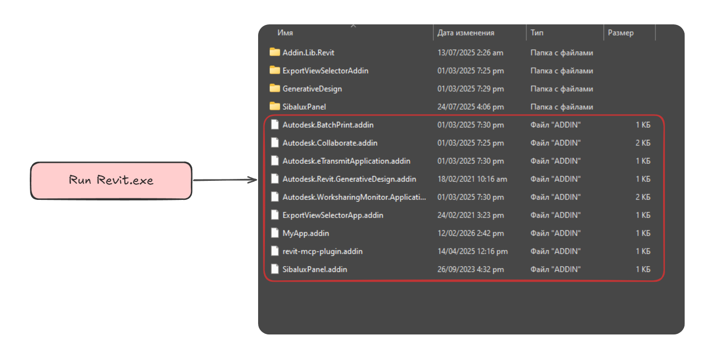


# Проблема: конфликты зависимостей

Так как .NET Framework 4.8 загружается **при старте процесса Revit.exe** как базовая CLR (Common Language Runtime) для всего приложения, до сканирования папки Addins. Плагины на .NET 4.8 (сборки плагинов) подхватываются в этом домене автоматически при парсинге .addin — без отдельной инициализации runtime

Revit использует **DefaultDomain** (не изолированный), поэтому все плагины делят один .NET 4.8 runtime.  Помимо этого Revit грузит еще "свои" сборки предварительно. Эти сборки имеют и свои зависимости, а они свои и так далее. 

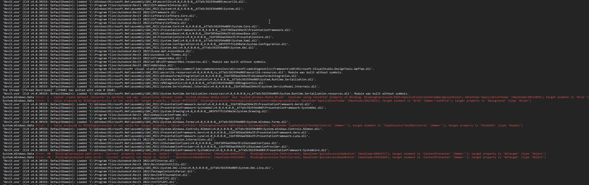 
Помимо вашего плагина могут быть установлены плагины и других разработчиков, которые могут использовать те же зависимости как у вас, только версии ниже или выше.
Отсюда и вытекает проблема конфликтов зависимостей между сборками в одном домене. Например - если подключить в свой проект следующие зависимости:
```csproj
<PackageReference Include="Serilog.Extensions.Logging" Version="9.0.0" />
<PackageReference Include="Serilog" Version="4.2.0" />
<PackageReference Include="Serilog.Sinks.File" Version="6.0.0" />
```
То возможен конфликт при инициализации логгера Serilog. А теперь представьте - что будет если вы будете использовать не только Serilog, а другие зависимости и зависимости зависимостей. В частности самые "опасные" - это WPF UI kit библиотеки. 

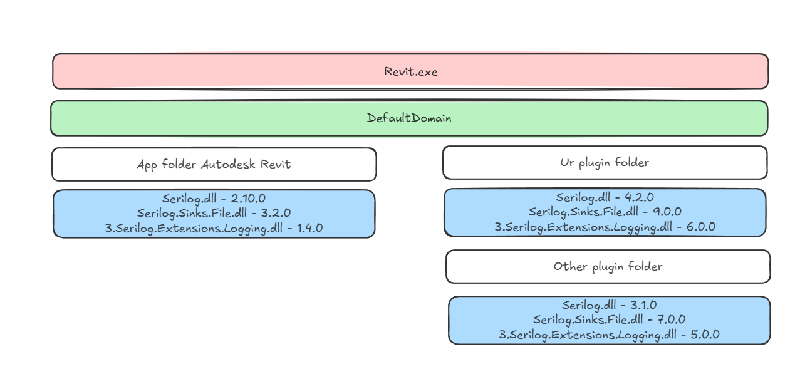

Сама опасность конфликта зависимостей  в том что проблема сложно прогнозируемая - ошибку можно получить и в рантайме - когда какой то плагин (а может быть это и ваш плагин) - получит исключение - что в больших решениях может послужить багам и фаталам, на которые нужны дополнительные трудозатраты разработчика. Падение может при вызове определенного метода, обращение к определенному свойству и тд.

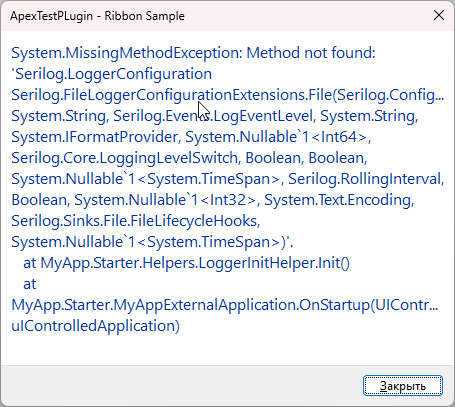


# Пути решения проблемы

Путей решений данной проблемы может быть много, начиная от редактирования IL код, заканчивая реализацией своих собственных "велосипедов" или "адаптацией" своих зависимостей под Revit и не устанавливать чужие плагины. 

В своей работе я каждый из способов реализовывал и понимаю что у каждого  есть свои минусы и плюсы (вопрос дискуссионный), но в данной статье они описываться не будут.

В данной статье будет описывать для меня один из самых как я думаю "безопасных" - как я думаю способов - реализации Cross Domain взаимодействия для того чтобы изолировать часть нашего плагина от "общего домена" - тем самым обезопасить себя от будущих конфликтов и быть уверенным что наши зависимости будут "жить отдельно".
# Цели реализации решения проблемы

Перед созданием решения и его реализации устранения проблемы необходимо понять - какие будут НФТ. Я вывел для примера текущей статьи следующие:
1. Решение должно изолировать конфликтующие зависимости от **DefaultDomain** рантайма, который предоставляет Revit.exe
2. Мы не должны быть ограничены выбором зависимостей .net48, нужно чтобы мы могли использовать любые WPF UI kit's, логирование и контейнер зависимостей
3. Необходима модульность и простота подключения новых модулей для нашего плагина
4. Абстрагирование от реализации, которая будет находится в другом домене
5. Взаимодействие с Revit должно быть возможно из другого домена асинхронно и синхронно
6. Удобный доступ управлением и получением зависимостей для стартапа, ядра и других модулей
Эти все требования я постараюсь реализовать и разобрать в данной статье.  

# Архитектура решения

Спроектируем принципиальную схему компонентов нашего плагина.

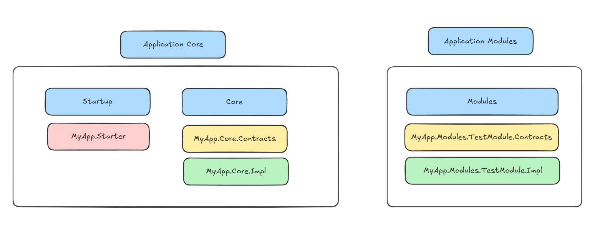

Application Core - наш стартап приложения и основные компоненты для реализации core функционала наших НФТ:
-  MyApp.Starter, MyApp.Core.Contracts - будут использоваться в  **DefaultDomain**  процесса revit.exe
- MyApp.Core.Impl - будет предоставлять реализации, вызываемые в другом домене, который назовем MyAppCoreDomain
Application Modules - модули, которые будут подключаться:
- MyApp.Modules.TestModule.Contracts - будут использоваться в  **DefaultDomain**
- MyApp.Modules.TestModule.Impl - будет использоваться в домене MyAppCoreDomain

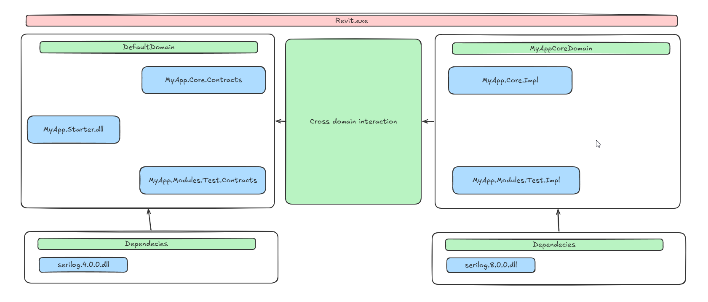

Внутренние компоненты сборок будут реализованы как можно примитивнее и проще - для того чтобы было проще понять саму суть решения проблемы.

Основная идея в том что для кроссдоменного общения достаточно создать контракт (интерфейсы) и реализовать проксирование через наследование [MarshalByRefObject]([https://learn.microsoft.com/ru-ru/dotnet/api/system.runtime.serialization.iserializable?view=netframework-4.8](https://learn.microsoft.com/ru-ru/dotnet/api/system.marshalbyrefobject?view=netframework-4.8)).

Помимо этого - для данных которые будут перемещаться между доменами нужно добавить возможность сериализовываться  и десериализовываться - например через атрибут  [Serializable](https://learn.microsoft.com/ru-ru/dotnet/api/system.serializableattribute?view=netframework-4.8)
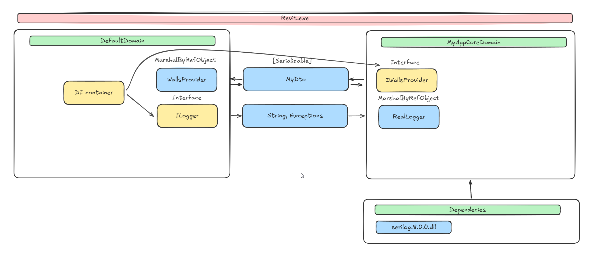
За создание домена у нас будет отвечать [AppDomain](https://learn.microsoft.com/ru-ru/dotnet/api/system.appdomain?view=netframework-4.8), который принимает сетап [AppDomainSetup](https://learn.microsoft.com/ru-ru/dotnet/api/system.appdomainsetup?view=netframework-4.8). В совокупности мы получаем возможность:
1. Передавать данные между доменами
2. Вызывать почти бесшовно и что важное - двухстороннее (в отличии от протоколов обмена данными) код в рамках одного процесса
3. Изоляцию на уровне доменов
4. Прогнозируемое поведение вызываемого кода
# Релизация ядра и домен менеджера

Для начала создадим основные контакты модулей и основные компоненты для этого в сборке MyApp.Core.Contracts.
```c#

/// <summary>
/// Базовый интерфейс модуля, работающего в отдельном AppDomain (домен Core).
/// В Initialize() реализация создаёт свой DI-контейнер и регистрирует зависимости.
/// </summary>
public interface IOtherDomainModule
{
    /// <summary>
    /// Инициализация модуля: создание DI-контейнера и регистрация зависимостей.
    /// Вызывается OtherAppDomainManager после создания прокси, до регистрации в основном контейнере.
    /// </summary>
    void Initialize();

    /// <summary>
    /// Прокси контейнера модуля (контейнер создаётся в Initialize()).
    /// </summary>
    IModuleContainer Container { get; }
}


/// <summary>
/// Модуль ядра домена Core: в контейнере зарегистрированы ILogger и другие общие сервисы.
/// ILogger доступен только через контейнер этого модуля.
/// </summary>
public interface ICoreModule : IOtherDomainModule
{
}

```

Core модуль и другие модули будут имплементировать данный интерфейс для того чтобы появилась возможность находить модули, вызывать инициализацию (например сетапить контейнер зависимостей именно для этого модуля). 

Сам модуль будет отвечать за предоставлением функции логирования, которая и  падала в рантайме ранее. Также в его состав можно внедрить другие "инфраструктурные" сервисы, зависимости которых конфликтуют и приводят к ошибка в рантайме, например клиент брокера, драйверы подключения к бд и тд.

Начнем с реализации компонентов для Core модуля, которые мы будем вызывать и которые вызывают падение кода из за конфликта зависимостей в рантайме - например логгер на основе Serilog.
```c#
/// <summary>
/// Абстракция логирования для вызова через границу AppDomain.
/// </summary>
public interface ILogger
{
    void Log(string message);
    void LogError(string message, Exception? ex = null);
}

```

Мы понимаем что у нас есть что-то - логгер, некий контракт для вызова, теперь нужно создать его реализацию в MyApp.Core.Impl - имплементация "с другой стороны домена" всегда должна наследоваться еще и от MarshalByRefObject, это важно:

```C#
/// <summary>
/// Реализация ILogger в домене Core с записью в файл через Serilog.
/// </summary>
[OtherDomainImplementation]
public class RealLogger : MarshalByRefObject, IAppLogger
{
    private Serilog.Core.Logger? _serilogger;

    public RealLogger()
    {
        var basePathForLog = Path.GetDirectoryName(typeof(RealLogger).Assembly.Location);
        var logDirectory = Path.Combine(basePathForLog ?? Path.GetTempPath(), "logs");
        if (!Directory.Exists(logDirectory))
            Directory.CreateDirectory(logDirectory);

        _serilogger = new LoggerConfiguration()
            .MinimumLevel.Debug()
            .WriteTo.File(Path.Combine(logDirectory, "myapp_engine-.txt"), rollingInterval: RollingInterval.Day)
            .CreateLogger();

        Log("RealLogger инициализирован в отдельном домене");
    }

    public void Log(string message)
    {
        _serilogger?.Write(LogEventLevel.Information, "{Message}", message);
    }

    public void LogError(string message, Exception? ex = null)
    {
        if (ex != null)
            _serilogger?.Write(LogEventLevel.Error, ex, "{Message}", message);
        else
            _serilogger?.Write(LogEventLevel.Error, "{Message}", message);
    }
}

/// <summary>
/// Маркирует класс как реализацию модуля, создаваемую в отдельном домена (Core).
/// Используется OtherAppDomainManager для поиска типов при инициализации.
/// </summary>
[AttributeUsage(AttributeTargets.Class, AllowMultiple = false)]
public class OtherDomainImplementationAttribute : Attribute { }


```

Атрибут OtherDomainImplementationAttribute нам нужен как и интерфейсы в будущем чтобы "метчить" контракт и его "реализацию" с помощью рефлексии.
В реализации мы будем использовать именно тот код, который приводил к падению в рантайме.

Также не забудем реализовать ICoreModule в MyApp.Core.Impl:

```c#
/// <summary>
/// Модуль ядра домена Core: в контейнере регистрируются ILogger и другие общие сервисы.
/// </summary>
[OtherDomainImplementation]
public sealed class CoreModule : MarshalByRefObject, ICoreModule
{
    private ServiceContainer? _container;
    private ModuleContainerProxy? _containerProxy;

    public void Initialize()
    {
        if (_container != null)
            return;

        new CoreDomainExceptionHandler().Register();

        var bootstrap = new CoreDomainDispatcherBootstrap();
        bootstrap.Start();

        _container = new ServiceContainer();
        _container.AddSingleton<ILogger>(_ => new RealLogger());
        _container.AddSingleton<ICoreDomainUiRunner>(_ => bootstrap);
        _containerProxy = new ModuleContainerProxy(_container);
    }

    public IModuleContainer Container
    {
        get
        {
            if (_containerProxy == null)
                throw new InvalidOperationException("Вызовите Initialize() перед обращением к Container.");
            return _containerProxy;
        }
    }
}

```

Также реализуем просто DI контейнер и прокси для него него - для вызова через границу домена:
```c#
/// <summary>
/// Время жизни сервиса в контейнере.
/// </summary>
public enum ServiceLifetime
{
    Singleton,
    Transient
}

/// <summary>
/// Минимальный DI-контейнер: Singleton, Transient и освобождение реализаций IDisposable при Dispose.
/// </summary>
public sealed class ServiceContainer : IDisposable
{
    private readonly Dictionary<Type, (Func<ServiceContainer, object?> Factory, ServiceLifetime Lifetime)> _registrations = new();
    private readonly Dictionary<Type, object?> _singletons = new();
    private bool _disposed;
    private readonly object _lock = new();

    /// <summary>
    /// Регистрирует сервис как Singleton. Экземпляр создаётся фабрикой при первом Resolve.
    /// </summary>
    public void AddSingleton<T>(Func<ServiceContainer, T> factory) where T : class?
    {
        if (_disposed)
            throw new ObjectDisposedException(nameof(ServiceContainer));
        _registrations[typeof(T)] = (c => factory(c), ServiceLifetime.Singleton);
    }

    /// <summary>
    /// Регистрирует сервис как Singleton по типу (для динамической регистрации модулей).
    /// </summary>
    public void AddSingleton(Type serviceType, Func<ServiceContainer, object?> factory)
    {
        if (_disposed)
            throw new ObjectDisposedException(nameof(ServiceContainer));
        if (serviceType == null || factory == null)
            throw new ArgumentNullException(serviceType == null ? nameof(serviceType) : nameof(factory));
        _registrations[serviceType] = (factory, ServiceLifetime.Singleton);
    }

    /// <summary>
    /// Регистрирует сервис как Transient. При каждом Resolve вызывается фабрика.
    /// </summary>
    public void AddTransient<T>(Func<ServiceContainer, T> factory) where T : class?
    {
        if (_disposed)
            throw new ObjectDisposedException(nameof(ServiceContainer));
        _registrations[typeof(T)] = (c => factory(c), ServiceLifetime.Transient);
    }

    /// <summary>
    /// Возвращает экземпляр сервиса.
    /// </summary>
    public T Resolve<T>() where T : class?
    {
        if (_disposed)
            throw new ObjectDisposedException(nameof(ServiceContainer));
        return (T)Resolve(typeof(T))!;
    }

    /// <summary>
    /// Возвращает экземпляр сервиса по типу.
    /// </summary>
    public object? Resolve(Type serviceType)
    {
        if (_disposed)
            throw new ObjectDisposedException(nameof(ServiceContainer));
        if (!_registrations.TryGetValue(serviceType, out var reg))
            throw new InvalidOperationException($"Сервис не зарегистрирован: {serviceType.FullName}");

        var (factory, lifetime) = reg;
        if (lifetime == ServiceLifetime.Singleton)
        {
            lock (_lock)
            {
                if (!_singletons.TryGetValue(serviceType, out var instance))
                {
                    instance = factory(this);
                    _singletons[serviceType] = instance;
                }
                return instance;
            }
        }
        return factory(this);
    }

    public void Dispose()
    {
        if (_disposed) return;
        lock (_lock)
        {
            foreach (var instance in _singletons.Values)
            {
                if (instance is IDisposable d)
                {
                    try { d.Dispose(); } catch { /* Игнорируем ошибки при освобождении сервиса. */ }
                }
            }
            _singletons.Clear();
            _disposed = true;
        }
    }
}

/// <summary>
/// Прокси контейнера модуля (MarshalByRefObject) для вызова через границу AppDomain.
/// </summary>
public sealed class ModuleContainerProxy : MarshalByRefObject, IModuleContainer
{
    private readonly ServiceContainer _container;

    public ModuleContainerProxy(ServiceContainer container)
    {
        _container = container ?? throw new ArgumentNullException(nameof(container));
    }

    public T Resolve<T>() where T : class?
    {
        return _container.Resolve<T>();
    }

    public override object? InitializeLifetimeService()
    {
        return null;
    }
}

/// <summary>
/// Доступ к DI-контейнеру модуля через границу AppDomain.
/// </summary>
public interface IModuleContainer
{
    T Resolve<T>() where T : class?;
}


```

Так как данный код будет вызываться в другом домене, то необходимо позаботиться о том чтобы перехватывать "нуправляемые" исключения. Раньше об этом заботился Revit.exe, но теперь - это наша проблема.
```c#
/// <summary>
/// Регистрирует глобальный перехватчик необработанных исключений в домене Core.
/// Создаётся и вызывается в целевом домене (через CreateInstanceFromAndUnwrap).
/// </summary>
public sealed class CoreDomainExceptionHandler : MarshalByRefObject
{
    /// <summary>
    /// Подписывается на UnhandledException в текущем AppDomain и показывает все необработанные исключения в MessageBox.
    /// </summary>
    public void Register()
    {
        AppDomain.CurrentDomain.UnhandledException += OnUnhandledException;
    }

    /// <summary>
    /// Подписывается на UnhandledException диспетчера WPF. Вызывать в STA-потоке (перед Dispatcher.Run).
    /// Перехватывает исключения из обработчиков событий, показывает MessageBox и помечает как Handled.
    /// </summary>
    public static void RegisterDispatcherUnhandledException(Dispatcher dispatcher)
    {
        if (dispatcher == null) return;
        dispatcher.UnhandledException += (_, e) =>
        {
            var ex = e.Exception;
            var message = ex != null
                ? $"{ex.GetType().Name}: {ex.Message}\n\n{ex.StackTrace}"
                : "Неизвестная ошибка";
            try
            {
                MessageBox.Show(message, "Ошибка (домен Core)", MessageBoxButton.OK, MessageBoxImage.Error);
            }
            catch
            {
                System.Diagnostics.Debug.WriteLine($"[Core Domain] Ошибка: {message}");
            }

            e.Handled = true;
        };
    }

    private static void OnUnhandledException(object sender, UnhandledExceptionEventArgs e)
    {
        var ex = e.ExceptionObject as Exception;
        var message = ex != null
            ? $"{ex.GetType().Name}: {ex.Message}\n\n{ex.StackTrace}"
            : e.ExceptionObject?.ToString() ?? "Неизвестная ошибка";
        var caption = e.IsTerminating ? "Критическая ошибка (домен Core)" : "Ошибка (домен Core)";

        MessageBox.Show(message, caption, MessageBoxButton.OK, MessageBoxImage.Error);
    }
}

```

Теперь так как мы будем в другом домене вызывать и WPF окна, нам нужно позаботится и о том чтобы у нас был свой UI бутстрапер:
```c#
/// <summary>
/// Запускает единственный STA-поток в домене Core, регистрирует перехватчик необработанных исключений Dispatcher.
/// Позволяет выполнять код в этом потоке через RunOnUi (показ WPF-окон).
/// </summary>
public sealed class CoreDomainDispatcherBootstrap : MarshalByRefObject, ICoreDomainDispatcherBootstrap, ICoreDomainUiRunner
{
    private volatile Dispatcher? _dispatcher;

    /// <summary>
    /// Запускает STA-поток, регистрирует обработчик исключений Dispatcher и входит в цикл сообщений.
    /// Возвращает управление после того, как Dispatcher создан в STA-потоке.
    /// </summary>
    public void Start()
    {
        var thread = new Thread(() =>
        {
            _dispatcher = Dispatcher.CurrentDispatcher;
            CoreDomainExceptionHandler.RegisterDispatcherUnhandledException(_dispatcher);
            Dispatcher.Run();
        });
        thread.SetApartmentState(ApartmentState.STA);
        thread.Start();

        for (int i = 0; i < 50; i++)
        {
            if (_dispatcher != null) break;
            Thread.Sleep(20);
        }
    }

    /// <summary>
    /// Выполняет действие в STA-потоке домена Core (синхронно).
    /// </summary>
    public void RunOnUi(Action action)
    {
        _dispatcher.Invoke(action);
    }
}

public interface ICoreDomainDispatcherBootstrap
{
    void Start();
}

/// <summary>
/// Выполнение кода в STA-потоке домена Core (на общем Dispatcher).
/// Реализация создаётся при инициализации домена; модули используют для показа окон.
/// </summary>
public interface ICoreDomainUiRunner
{
    /// <summary>Выполняет действие в STA-потоке домена (синхронно).</summary>
    void RunOnUi(Action action);
}

```

Что мы имеем:
1. Мы понимаем что такое модули и можем найти их типы в любых сборках (с помощью интерфейса IOtherDomainModule)
2. Мы понимаем что за типы реализовывают наши интерфейсы в другом домене (с помощью атрибута OtherDomainImplementationAttribute)
3. Мы уверены что в другом домене если мы получим эксепшен, то он обработается.

Теперь необходимо реализовать сам домен менеджер. Создадим простой конфиг для него:

```c#
/// <summary>
/// Настройки для OtherAppDomainManager: пути к сборкам, имя домена Core, паттерн поиска модулей.
/// </summary>
public class AppDomainManagerConfig
{
    /// <summary>Имя сборки контрактов (для CoreDomainSetup).</summary>
    public string ContractCoreAssemblyPath { get; set; } = "MyApp.Core.Contracts";

    /// <summary>Имя сборки с реализацией ICoreModule.</summary>
    public string ImplCoreAssemblyPath { get; set; } = "MyApp.Core.Impl";

    /// <summary>Имя создаваемого AppDomain.</summary>
    public string DomainName { get; set; } = "MyAppCoreDomain";

    /// <summary>Относительный путь к папке со сборками Core (от каталога стартера).</summary>
    public string CorePathRelative { get; set; } = "Core";

    /// <summary>Паттерн имён сборок для поиска остальных модулей (например MyApp.Modules.*).</summary>
    public string OtherModuleAssemblyPattern { get; set; } = "MyApp.Modules.*";

    /// <summary>Конфиг с значениями по умолчанию.</summary>
    public static AppDomainManagerConfig Default { get; } = new AppDomainManagerConfig();
}

```
Реализуем сам менеджер:
```c#
/// <summary>
/// Создаёт отдельный AppDomain (домен Core) и регистрирует модули (ICoreModule и др.) через IOtherDomainModule.
/// После создания прокси вызывается Initialize(), затем модуль регистрируется в DIContainerContext как синглтон.
/// </summary>
public static class OtherAppDomainManager
{
    private static AppDomain? _workerDomain;
    private static bool _isInitialized;

    /// <summary>
    /// Создаёт домен Core, настраивает загрузку сборок, регистрирует ICoreModule и остальные модули по паттерну в DIContainerContext.
    /// </summary>
    /// <param name="config">Настройки путей и имён; при null используется AppDomainManagerConfig.Default.</param>
    public static void Initialize(AppDomainManagerConfig? config = null)
    {
        config ??= AppDomainManagerConfig.Default;
        if (_isInitialized) return;

        try
        {
            var starterDir = Path.GetDirectoryName(Assembly.GetExecutingAssembly().Location);
            var corePath = Path.Combine(starterDir ?? Path.GetTempPath(), config.CorePathRelative);

            if (!Directory.Exists(corePath))
            {
                WriteError($"{DateTime.Now}: Папка не найдена: {corePath}");
                throw new InvalidOperationException($"Папка не найдена: {corePath}. Разверните сборки Core в эту папку.");
            }

            var setup = new AppDomainSetup
            {
                ApplicationBase = corePath,
                PrivateBinPath = corePath,
                ShadowCopyFiles = "true",
                LoaderOptimization = LoaderOptimization.MultiDomainHost
            };

            _workerDomain = AppDomain.CreateDomain(config.DomainName, null, setup);

            var contractsDllPath = Path.Combine(corePath, $"{config.ContractCoreAssemblyPath}.dll");
            var domainSetup = (CoreDomainSetup)_workerDomain.CreateInstanceFromAndUnwrap(
                contractsDllPath,
                typeof(CoreDomainSetup).FullName!);
            domainSetup.SetResolveOnlyFromBasePath(corePath);

            var container = DIContainerContext.Current;
            if (container == null)
                throw new InvalidOperationException("DI-контейнер должен быть создан и установлен в DIContainerContext до вызова AppDomainManager.Initialize().");

            // 1. Регистрируем ICoreModule первым (интерфейс известен в домене Revit)
            var coreDllPath = Path.Combine(corePath, $"{config.ImplCoreAssemblyPath}.dll");
            var coreAsm = Assembly.LoadFrom(coreDllPath);
            var coreImplType = FindEntryPoint(coreAsm, typeof(ICoreModule));
            var coreModuleProxy = (IOtherDomainModule)_workerDomain.CreateInstanceFromAndUnwrap(
                coreDllPath,
                coreImplType.FullName!,
                false,
                BindingFlags.Default,
                null,
                Array.Empty<object>(),
                null,
                null);
            coreModuleProxy.Initialize();
            container.AddSingleton(typeof(ICoreModule), _ => coreModuleProxy);

            var uiRunner = coreModuleProxy.Container.Resolve<ICoreDomainUiRunner>();

            // 2. Остальные модули — по паттерну имён сборок (MyApp.Modules.*)
            var otherAssemblyNames = GetAssemblyNamesMatchingPattern(corePath, config.OtherModuleAssemblyPattern);
            foreach (var assemblyName in otherAssemblyNames)
            {
                var dllPath = Path.Combine(corePath, $"{assemblyName}.dll");
                if (!File.Exists(dllPath))
                {
                    WriteError($"{DateTime.Now}: Сборка не найдена: {dllPath}");
                    throw new InvalidOperationException($"Сборка не найдена: {dllPath}");
                }

                var asm = Assembly.LoadFrom(dllPath);
                foreach (var (interfaceType, implType) in DiscoverOtherDomainModules(asm))
                {
                    var ctorArgs = ResolveCtorArgs(implType, coreModuleProxy, uiRunner);
                    var proxy = (IOtherDomainModule)_workerDomain.CreateInstanceFromAndUnwrap(
                        dllPath,
                        implType.FullName!,
                        false,
                        BindingFlags.Default,
                        null,
                        ctorArgs,
                        null,
                        null);
                    proxy.Initialize();
                    container.AddSingleton(interfaceType, _ => proxy);
                }
            }

            var logger = coreModuleProxy.Container.Resolve<ILogger>();
            logger.Log("Модули успешно инициализированы");

            _isInitialized = true;
        }
        catch (Exception ex)
        {
            WriteError($"{DateTime.Now}: Ошибка инициализации AppDomain: {ex}");
            throw;
        }
    }

    /// <summary>Возвращает имена DLL в corePath, совпадающие с паттерном (например MyApp.Modules.*).</summary>
    private static IEnumerable<string> GetAssemblyNamesMatchingPattern(string corePath, string pattern)
    {
        if (!Directory.Exists(corePath))
            yield break;
        foreach (var file in Directory.EnumerateFiles(corePath, "*.dll"))
        {
            var assemblyName = Path.GetFileNameWithoutExtension(file);
            if (AssemblyNameMatchesPattern(assemblyName, pattern))
                yield return assemblyName;
        }
    }

    /// <summary>Проверяет совпадение имени сборки с паттерном (поддержка суффикса *).</summary>
    private static bool AssemblyNameMatchesPattern(string assemblyName, string pattern)
    {
        if (string.IsNullOrEmpty(pattern))
            return false;
        if (pattern.EndsWith("*", StringComparison.Ordinal))
        {
            var prefix = pattern.TrimEnd('*');
            return assemblyName.StartsWith(prefix, StringComparison.OrdinalIgnoreCase);
        }
        return string.Equals(assemblyName, pattern, StringComparison.OrdinalIgnoreCase);
    }

    /// <summary>Находит в сборке класс с OtherDomainImplementationAttribute, реализующий указанный интерфейс.</summary>
    private static Type FindEntryPoint(Assembly asm, Type interfaceType)
    {
        Type[] types;
        try
        {
            types = asm.GetTypes();
        }
        catch (ReflectionTypeLoadException e)
        {
            types = e.Types ?? Array.Empty<Type>();
        }

        var type = types
            .Where(t => t != null && !t.IsInterface && !t.IsAbstract)
            .FirstOrDefault(t => interfaceType.IsAssignableFrom(t!) &&
                t!.GetCustomAttribute<OtherDomainImplementationAttribute>() != null);

        return type ?? throw new InvalidOperationException(
            $"Не найден класс с атрибутом {nameof(OtherDomainImplementationAttribute)} " +
            $"и реализующий {interfaceType.Name} в {asm.FullName}");
    }

    /// <summary>Находит в сборке пары (интерфейс, реализация) для модулей с OtherDomainImplementationAttribute, кроме ICoreModule.</summary>
    private static IEnumerable<(Type InterfaceType, Type ImplType)> DiscoverOtherDomainModules(Assembly asm)
    {
        Type[] types;
        try
        {
            types = asm.GetTypes();
        }
        catch (ReflectionTypeLoadException e)
        {
            types = e.Types ?? Array.Empty<Type>();
        }

        foreach (var t in types.Where(t => t != null && !t.IsInterface && !t.IsAbstract))
        {
            if (t!.GetCustomAttribute<OtherDomainImplementationAttribute>() == null)
                continue;
            if (!typeof(IOtherDomainModule).IsAssignableFrom(t))
                continue;

            var iface = t.GetInterfaces()
                .FirstOrDefault(i => i != typeof(IOtherDomainModule) && typeof(IOtherDomainModule).IsAssignableFrom(i));
            if (iface == null || iface == typeof(ICoreModule))
                continue;

            yield return (iface, t);
        }
    }

    /// <summary>Подбирает аргументы конструктора реализации: (ICoreModule) или (ICoreModule, ICoreDomainUiRunner).</summary>
    private static object?[] ResolveCtorArgs(Type implType, IOtherDomainModule coreModuleProxy, ICoreDomainUiRunner uiRunner)
    {
        var ctors = implType.GetConstructors(BindingFlags.Public | BindingFlags.Instance);
        foreach (var c in ctors)
        {
            var ps = c.GetParameters();
            if (ps.Length == 2 && ps[0].ParameterType == typeof(ICoreModule) && ps[1].ParameterType == typeof(ICoreDomainUiRunner))
                return new object[] { coreModuleProxy, uiRunner };
            if (ps.Length == 1 && ps[0].ParameterType == typeof(ICoreModule))
                return new object[] { coreModuleProxy };
        }
        return Array.Empty<object>();
    }

    /// <summary>Выгружает домен Core и сбрасывает состояние менеджера.</summary>
    public static void Shutdown()
    {
        if (_workerDomain == null) return;
        try
        {
            try
            {
                var core = DIContainerContext.Current?.Resolve<ICoreModule>();
                core?.Container.Resolve<ILogger>()?.Log("Выгрузка домена Core...");
            }
            catch
            {
                // Игнорируем ошибки при логировании перед выгрузкой домена.
            }

            AppDomain.Unload(_workerDomain);
            _workerDomain = null;
            _isInitialized = false;
        }
        catch (Exception ex)
        {
            WriteError($"{DateTime.Now}: Ошибка выгрузки домена: {ex}");
        }
    }

    /// <summary>Дописывает сообщение об ошибке в файл myapp_error.txt во временной папке.</summary>
    internal static void WriteError(string text)
    {
        var path = Path.Combine(Path.GetTempPath(), "myapp_error.txt");
        File.AppendAllText(path, text + Environment.NewLine);
    }
}

```

Он будет отвечать за:
1. Нахождении файлов сборок наших модулей
2. Созданием нового домена
3. Создании экземпляра класса core модуля и инициализация его вместе с его зависимостями
4. Нахождение и создании экземпляра класса других модулей и их инициализация вместе с их зависимостями 

В будущем его функционал можно декомпозировать для более удобной эксплуатации. Помимо этого мы можешь обращаться к его зависимостей  с домена Revit и использовать их:
```c#
	var logger = coreModuleProxy.Container.Resolve<ILogger>();
	logger.Log("Модули успешно инициализированы");
``` 

Реализация будет происходит в другом домене и логгер не будет падать, так как код, выполняемый изолирован - он в другом домене.

# Реализация отдельного модуля ITestSampleModule

Модуль будет предоставлять функционал следующий:
1. Открытие окна со случайными данными, сгенерированные в revit домена
2. Открытие демо-окна Material Design - блокируя UI revit
3. Открытие окна со списком стен MahApps.Metro, блокирует до закрытия. Окно будет позволять пользователю удалять элементы после выделения их в UI и последующем закрытием окна
4. Открытие окна HandyControl без ожидания, с выделением элементов в Revit и их удалением налету
5. Создание файла экселя на основе библиотеки ClosedXML и последующее сохранение данного файла в файловой системе

Создадим контракт модуля и его реализацию:
```c#
   /// <summary>
/// Контроллер модуля в домене Core: открытие окон, работа с Excel. Вызывается из домена Revit через прокси.
/// </summary>
public interface ITestSampleModule : IOtherDomainModule
{
    /// <summary>Открывает окно со случайными данными (немодально).</summary>
    void ShowRandomDataWindow();

    /// <summary>Открывает демо-окно Material Design (модально).</summary>
    void ShowMaterialWindow();

    /// <summary>Открывает окно со списком стен (MahApps.Metro), блокирует до закрытия; возвращает выбранный id стены или null.</summary>
    string? ShowMetroWindow(WallsViewModel viewModel);

    /// <summary>Открывает окно HandyControl без ожидания; wallsProvider — список стен, selectionService — выделение в Revit, deleteReceiver — удаление элемента.</summary>
    void ShowHandyControlWindow(WallsViewModel viewModel, IWallsProvider wallsProvider, IElementSelectionService selectionService, IDeleteCommandHandler deleteReceiver);

    /// <summary>Создаёт временный Excel-файл в указанной папке.</summary>
    void CreateTempExcelFile(string targetDirectory);
}


/// <summary>
/// Реализация модуля в домене Core: создаёт ViewModel и открывает WPF-окна в общем STA-потоке (RunOnUi).
/// </summary>
[OtherDomainImplementation]
public class TestSampleModule : MarshalByRefObject, ITestSampleModule
{
    private ICoreModule? _coreModule;
    private ICoreDomainUiRunner? _uiRunner;
    private ServiceContainer? _container;
    private IModuleContainer? _containerProxy;

    public TestSampleModule(ICoreModule coreModule, ICoreDomainUiRunner uiRunner)
    {
        _coreModule = coreModule ?? throw new ArgumentNullException(nameof(coreModule));
        _uiRunner = uiRunner ?? throw new ArgumentNullException(nameof(uiRunner));
    }

    public void Initialize()
    {
        if (_container != null)
            return;
        if (_coreModule == null)
            throw new InvalidOperationException("CoreModule не задан.");

        _container = new ServiceContainer();
        var logger = _coreModule.Container.Resolve<ILogger>();
        _container.AddSingleton<ILogger>(_ => logger);
        _container.AddSingleton<ExcelService>(c => new ExcelService(c.Resolve<ILogger>()));

        _containerProxy = new ModuleContainerProxy(_container);
    }

    public IModuleContainer Container
    {
        get
        {
            if (_containerProxy == null)
                throw new InvalidOperationException("Вызовите Initialize() перед обращением к Container.");
            return _containerProxy;
        }
    }

    public void ShowRandomDataWindow()
    {
        var logger = Container.Resolve<ILogger>();
        logger.Log("Создание случайных данных для окна...");

        var random = new Random();
        var viewModel = new RandomDataViewModel
        {
            Title = $"Отчёт от {DateTime.Now:yyyy-MM-dd HH:mm:ss}",
            GeneratedAt = DateTime.Now,
            Items = new List<RandomItem>()
        };

        for (int i = 0; i < 10; i++)
        {
            viewModel.Items.Add(new RandomItem
            {
                Id = i + 1,
                Name = $"Элемент {i + 1}",
                Value = Math.Round(random.NextDouble() * 100, 2)
            });
        }

        logger.Log($"Сгенерировано {viewModel.Items.Count} элементов");

        _uiRunner!.RunOnUi(() =>
        {
            var window = new RandomDataWindow(viewModel);
            window.ShowDialog();
        });

        logger.Log("Окно закрыто");
    }

    public void ShowMaterialWindow()
    {
        var logger = Container.Resolve<ILogger>();
        logger.Log("Открытие окна Material Design...");
        _uiRunner!.RunOnUi(() =>
        {
            var window = new MaterialDemoWindow();
            window.ShowDialog();
        });
        logger.Log("Окно Material закрыто");
    }

    public string? ShowMetroWindow(WallsViewModel viewModel)
    {
        var logger = Container.Resolve<ILogger>();
        logger.Log("Открытие окна MahApps.Metro...");
        if (viewModel == null)
            throw new ArgumentNullException(nameof(viewModel));

        _uiRunner!.RunOnUi(() =>
        {
            var window = new MetroDemoWindow(viewModel);
            window.ShowDialog();
        });
        logger.Log("Окно Metro закрыто");
        return viewModel.SelectedWallId;
    }

    public void ShowHandyControlWindow(WallsViewModel viewModel, IWallsProvider wallsProvider, IElementSelectionService selectionService, IDeleteCommandHandler deleteReceiver)
    {
        var logger = Container.Resolve<ILogger>();
        logger.Log("Открытие окна HandyControl (немодальное)...");

        _uiRunner!.RunOnUi(() =>
        {
            try
            {
                var window = new HandyControlDemoWindow(viewModel, wallsProvider, selectionService, deleteReceiver);
                window.Show();
            }
            catch (Exception ex)
            {
                logger.LogError("Ошибка при открытии окна HandyControl", ex);
            }
        });
    }

    public void CreateTempExcelFile(string targetDirectory)
    {
        Container.Resolve<ExcelService>().CreateTempExcelFile(targetDirectory);
    }
}


```

Воспринимать модули в данном контексте можно как UseCase компоненты - то что оркеструет бизнес-логикой одного флоу, если необходимо хранить состояния, то можно использовать контейнер зависимостей модуля или модуля чью зависимости нужны (например CoreModule):
```c#
        _container = new ServiceContainer();
        var logger = _coreModule.Container.Resolve<ILogger>();
        _container.AddSingleton<ILogger>(_ => logger);
        _container.AddSingleton<ExcelService>(c => new ExcelService(c.Resolve<ILogger>()));
        _container.AddSingleton<TestModuleServiceFactory>(c => new TestModuleServiceFactory(c.Resolve<ILogger>()));

        _containerProxy = new ModuleContainerProxy(_container);
```

Это позволяет декомпозировать большие модули и масштабировать свое приложение. При необходимости можно делегировать на модули регистрацию апдейтеров Revit.

# Пример взаимодействия между доменами

В качестве примера возьмем два основных флоу между revit и частью нашего приложения в другом домене, а именно самые частые кейсы:
1. Когда нам нужно синхронно открыть окно при вызове IExternalCommand.Execute() и выполнить блокирующий ввод, после дальше продолжить выполнение в контексте Revit
2. Когда нам нужно не синхронно открыть окно при вызове IExternalCommand.Execute(), закончить выполнение комманды, выполнив неблокирующий ввод, после иметь возможность мутировать BIM модель, сохранив выполнение в контексте Revit 
Код верстки XAML я не буду показывать, для того чтобы не нагромождать статью кодом.

В первом случае создадим команду для вызова данного функционала:
```c#
/// <summary>
/// Команда ленты Revit: открывает модальное окно MahApps.Metro со списком стен, после закрытия удаляет выбранную стену.
/// </summary>
[Transaction(TransactionMode.Manual)]
public sealed class ShowMetroWindowCommand : IExternalCommand
{
    /// <summary>Выполняет команду: сбор списка стен, вызов ShowMetroWindow(), удаление выбранной стены.</summary>
    public Result Execute(ExternalCommandData commandData, ref string message, ElementSet elements)
    {
        var logger = DIContainerContext.Current?.Resolve<ICoreModule>()?.Container.Resolve<ILogger>();
        logger?.Log("Команда ShowMetroWindow выполнена");

        var testModule = DIContainerContext.Current?.Resolve<ITestSampleModule>();
        if (testModule == null)
        {
            message = "Внешний домен не инициализирован (Core домен).";
            return Result.Failed;
        }

        var doc = commandData.Application.ActiveUIDocument?.Document;
        if (doc == null)
        {
            message = "Нет активного документа.";
            return Result.Failed;
        }

        var viewModel = CollectWallsViewModel(doc);

        try
        {
            var selectedId = testModule.ShowMetroWindow(viewModel);
            logger?.Log("ShowMetroWindow завершён (окно закрыто)");

            if (!string.IsNullOrEmpty(selectedId))
            {
                DeleteWallById(doc, selectedId);
                logger?.Log($"Стена {selectedId} удалена.");
            }

            return Result.Succeeded;
        }
        catch (Exception ex)
        {
            logger?.LogError("Ошибка открытия окна Metro", ex);
            message = ex.Message;
            return Result.Failed;
        }
    }

    private static WallsViewModel CollectWallsViewModel(Document doc)
    {
        var viewModel = new WallsViewModel();
        var collector = new FilteredElementCollector(doc)
            .OfCategory(BuiltInCategory.OST_Walls)
            .WhereElementIsNotElementType();
        foreach (Element el in collector)
        {
            viewModel.Walls.Add(new WallItem
            {
                Id = el.Id.IntegerValue.ToString(),
                Name = el.Name ?? string.Empty
            });
        }
        return viewModel;
    }

    private static void DeleteWallById(Document doc, string? wallId)
    {
        if (string.IsNullOrEmpty(wallId))
            return;
        var elementId = new ElementId(int.Parse(wallId));
        var element = doc.GetElement(elementId);
        if (element == null)
            return;
        using var tx = new Transaction(doc, "Удаление стены");
        tx.Start();
        doc.Delete(element.Id);
        tx.Commit();
    }
}

```

Это будет простая команда, которая производит заполнение данными окна и ожидает ввод пользователя - выбор элементов. После выбора производится удаление - все в контексте Revit:
```c#
    public string? ShowMetroWindow(WallsViewModel viewModel)
    {
        var logger = Container.Resolve<ILogger>();
        logger.Log("Открытие окна MahApps.Metro...");
        if (viewModel == null)
            throw new ArgumentNullException(nameof(viewModel));

        _uiRunner!.RunOnUi(() =>
        {
            var window = new MetroDemoWindow(viewModel);
            window.ShowDialog();
        });
        logger.Log("Окно Metro закрыто");
        return viewModel.SelectedWallId;
    }
```

Мы передаем данные через дто, которую мы назвали как вьюмодель и используем [Serializable] для передачи через домены:
```c#
/// <summary>Элемент списка стен (id и имя) для передачи через границу AppDomain.</summary>
[Serializable]
public class WallItem
{
    public string Id { get; set; } = string.Empty;
    public string Name { get; set; } = string.Empty;
}

/// <summary>Модель представления списка стен и выбранного id для окон Metro/HandyControl.</summary>
[Serializable]
public class WallsViewModel
{
    public List<WallItem> Walls { get; set; } = new();
    public string? SelectedWallId { get; set; }
}

```

После получения данных мы наполняем наше окно и через ui runner мы запускаем его:
```c#
/// <summary>
/// Модальное окно MahApps.Metro со списком стен; выбранный id возвращается через WallsViewModel.SelectedWallId.
/// </summary>
public partial class MetroDemoWindow : MetroWindow
{
    private readonly WallsViewModel _viewModel;

    public MetroDemoWindow(WallsViewModel viewModel)
    {
        _viewModel = viewModel ?? throw new ArgumentNullException(nameof(viewModel));
        InitializeComponent();
        DataContext = _viewModel;
    }

    private void CloseButton_Click(object sender, RoutedEventArgs e)
    {
        ApplySelection();
        Close();
    }

    protected override void OnClosed(EventArgs e)
    {
        ApplySelection();
        base.OnClosed(e);
    }

    private void ApplySelection()
    {
        if (_viewModel != null && WallsDataGrid?.SelectedItem is WallItem selected)
            _viewModel.SelectedWallId = selected.Id;
    }
}

```
После завершения ввода пользователя домен Revit получает результат и выполняет дальнейшие действия по удалению.

Рассмотрим теперь второй пример, который будет сложнее. За счет того что мы будем использовать не синхронное выполнение кода в не контексте  Revit. Для этого можно использовать IExternalEventHandler, который позволяет это делать. Я буду использовать нугет пакет [RevitTask](https://github.com/WhiteSharq/RevitTask) - который абстрагирует вызов IExternalEventHandler как Task.

Для начала что нам необходимо реализовать:
1. Организовать "бесшовное" двухсторонне общение между доменами
2. Вызов кода Revit должен быть в его контексте
3. Возможно не только читать данные, но и мутировать состояние Revit

Реализуем контракты и реализации "хендлеров" в MyApp.Modules.Test.Contracts, которые будут выполняться на стороне Revit:

```c#

/// <summary>
/// Провайдер списка стен из документа Revit. Реализация в домене Revit (MarshalByRefObject);
/// вызывается из домена Core по кнопке «Получить стены».
/// </summary>
public interface IWallsProvider
{
    WallsViewModel GetWalls();
}

/// <summary>
/// Провайдер списка стен из документа Revit. GetWalls() выполняется на потоке Revit через RevitTask.
/// </summary>
public sealed class WallsProvider : MarshalByRefObject, IWallsProvider
{
    private readonly RevitTask _revitTask;

    public WallsProvider(UIApplication application, Document document, RevitTask revitTask)
    {
        _ = document ?? throw new ArgumentNullException(nameof(document));
        _revitTask = revitTask ?? throw new ArgumentNullException(nameof(revitTask));
    }

    public WallsViewModel GetWalls()
    {
        try
        {
            return _revitTask.Run((app) =>
            {
                var doc = app.ActiveUIDocument?.Document;
                var vm = new WallsViewModel();
                if (doc != null && doc.IsValidObject)
                {
                    var collector = new FilteredElementCollector(doc)
                        .OfCategory(BuiltInCategory.OST_Walls)
                        .WhereElementIsNotElementType();
                    foreach (Element el in collector)
                    {
                        vm.Walls.Add(new WallItem
                        {
                            Id = el.Id.IntegerValue.ToString(),
                            Name = el.Name ?? string.Empty
                        });
                    }
                }
                return vm;
            }).GetAwaiter().GetResult();
        }
        catch (Exception)
        {
            return new WallsViewModel();
        }
    }
}

/// <summary>
/// Выделение элемента в Revit по id. Реализация в домене Revit (MarshalByRefObject);
/// вызывается из домена Core при выборе строки в таблице.
/// </summary>
public interface IElementSelectionService
{
    void SelectElement(string? elementId);
}


/// <summary>
/// Выделение элемента в Revit по id. Выполняется на потоке Revit через RevitTask.
/// </summary>
public sealed class ElementSelectionService : MarshalByRefObject, IElementSelectionService
{
    private readonly RevitTask _revitTask;

    public ElementSelectionService(UIApplication application, RevitTask revitTask)
    {
        _revitTask = revitTask ?? throw new ArgumentNullException(nameof(revitTask));
    }

    public void SelectElement(string? elementId)
    {
        if (string.IsNullOrEmpty(elementId))
            return;

        var id = elementId;
        _ = _revitTask.Run((app) =>
        {
            var doc = app.ActiveUIDocument?.Document;
            if (doc == null || !doc.IsValidObject)
                return;

            try
            {
                var elementId = new ElementId(int.Parse(id));
                var element = doc.GetElement(elementId);
                if (element != null)
                    app.ActiveUIDocument!.Selection.SetElementIds(new[] { element.Id });
            }
            catch
            {
                // Элемент мог быть удалён или документ закрыт — игнорируем.
            }
        });
    }
}


/// <summary>
/// Приёмник запроса на удаление элемента в Revit. Реализация в домене Revit (MarshalByRefObject);
/// вызывается из домена Core при нажатии «Удалить» в окне.
/// </summary>
public interface IDeleteCommandHandler
{
    /// <summary>Синхронный запрос на удаление элемента. Возвращает сериализуемый результат для передачи через границу AppDomain.</summary>
    DoimainResult<int> RequestDelete(string? elementId);
}


/// <summary>
/// Обработчик удаления элемента в Revit. Выполняется на потоке Revit через RevitTask.
/// </summary>
public sealed class DeleteCommandHandler : MarshalByRefObject, IDeleteCommandHandler
{
    private readonly RevitTask _revitTask;

    public DeleteCommandHandler(UIApplication application, Document document, RevitTask revitTask)
    {
        Document = document ?? throw new ArgumentNullException(nameof(document));
        _revitTask = revitTask;
    }

    public Document Document { get; }

    public DoimainResult<int> RequestDelete(string? elementIdInt)
    {
        try
        {
            if (string.IsNullOrEmpty(elementIdInt))
                return DoimainResult<int>.Fail("Не указан id элемента");

            var result = _revitTask.Run((app) =>
            {
                var doc = app.ActiveUIDocument.Document;
                var elementId = new ElementId(int.Parse(elementIdInt));
                var element = doc.GetElement(elementId);
                if (element == null)
                    return DoimainResult<int>.Fail("Не удалось удалить элемент");

                using var tx = new Transaction(doc, "Удаление элемента");
                if (tx.Start() == TransactionStatus.Started)
                {
                    doc.Delete(element.Id);
                    tx.Commit();
                }

                return DoimainResult<int>.Ok(1);
            }).GetAwaiter().GetResult();

            return result;
        }
        catch (Exception ex)
        {
            TaskDialog.Show("Удаление элемента", ex.Message);
            return DoimainResult<int>.Fail(ex.Message);
        }
    }
}

```

Мы имеем 3 хендлера на мутацию\на запрос данных с BIM модели. Удаление элементов, получение элементов и выделение элементов в модели - все будет вызываться из нашего окна, которое в другом домене.
В качестве дто, например чтобы получать результат мутации BIM модели создадим простой класс результата операции:
```c#
/// <summary>
/// Сериализуемый результат операции для передачи через границу AppDomain.
/// </summary>
/// <typeparam name="T">Тип полезных данных результата.</typeparam>
[Serializable]
public sealed class DoimainResult<T>
{
    /// <summary>Признак успешного выполнения.</summary>
    public bool Success { get; set; }

    /// <summary>Сообщение об ошибке или пояснение.</summary>
    public string? Message { get; set; }

    /// <summary>Данные результата.</summary>
    public T? Data { get; set; }

    /// <summary>Создаёт успешный результат с данными.</summary>
    public static DoimainResult<T> Ok(T data) => new() { Success = true, Data = data };

    /// <summary>Создаёт результат с ошибкой.</summary>
    public static DoimainResult<T> Fail(string message) => new() { Success = false, Message = message };
}

```

Создаем новую команду, которая будет создавать зависимости и вызывать данное окно:
```c#
/// <summary>
/// Команда ленты Revit: открывает немодальное окно HandyControl со списком стен, выделением и удалением.
/// </summary>
[Transaction(TransactionMode.Manual)]
public sealed class ShowHandyControlWindowCommand : IExternalCommand
{
    /// <summary>Выполняет команду: создание провайдеров и вызов ITestSampleModule.ShowHandyControlWindow().</summary>
    public Result Execute(ExternalCommandData commandData, ref string message, ElementSet elements)
    {
        var logger = DIContainerContext.Current?.Resolve<ICoreModule>()?.Container.Resolve<ILogger>();
        logger?.Log("Команда ShowHandyControlWindow выполнена");

        var testModule = DIContainerContext.Current?.Resolve<ITestSampleModule>();
        if (testModule == null)
        {
            message = "Внешний домен не инициализирован (Core домен).";
            return Result.Failed;
        }

        var doc = commandData.Application.ActiveUIDocument.Document;

        var revitTask = DIContainerContext.Current?.Resolve<RevitTask>();
        if (revitTask == null)
        {
            message = "RevitTask не зарегистрирован в контейнере.";
            return Result.Failed;
        }

        var viewModel = new WallsViewModel();
        var wallsProvider = new WallsProvider(commandData.Application, doc, revitTask);
        var selectionService = new ElementSelectionService(commandData.Application, revitTask);
        var handler = new DeleteCommandHandler(commandData.Application, doc, revitTask);

        testModule.ShowHandyControlWindow(viewModel, wallsProvider, selectionService, handler);
        logger?.Log("Окно HandyControl открыто (немодальное)");
        return Result.Succeeded;
    }
}

```

Между доменом где наше окно и доменом Revit будет двухстороннее общение через контракты хендлеров. Таким образом мы можем бесшовно вызывать хендлеры и получать результат их выполнения:
```c#
/// <summary>
/// Немодальное окно HandyControl: список стен, выделение в Revit, удаление через IDeleteCommandHandler.
/// </summary>
public partial class HandyControlDemoWindow : Window
{
    private readonly IWallsProvider _wallsProvider;
    private readonly IElementSelectionService _selectionService;
    private readonly IDeleteCommandHandler _deleteReceiver;
    private readonly ObservableCollection<WallItem> _displayWalls;

    public HandyControlDemoWindow(WallsViewModel viewModel, 
        IWallsProvider wallsProvider, 
        IElementSelectionService selectionService, 
        IDeleteCommandHandler deleteReceiver)
    {
        _ = viewModel ?? throw new ArgumentNullException(nameof(viewModel));
        _wallsProvider = wallsProvider ?? throw new ArgumentNullException(nameof(wallsProvider));
        _selectionService = selectionService ?? throw new ArgumentNullException(nameof(selectionService));
        _deleteReceiver = deleteReceiver ?? throw new ArgumentNullException(nameof(deleteReceiver));
        _displayWalls = new ObservableCollection<WallItem>();
        InitializeComponent();
        WallsDataGrid.ItemsSource = _displayWalls;
    }

    private void GetWallsButton_Click(object sender, RoutedEventArgs e)
    {
        var vm = _wallsProvider.GetWalls();
        _displayWalls.Clear();
        foreach (var w in vm.Walls)
            _displayWalls.Add(w);
    }

    private void WallsDataGrid_SelectionChanged(object sender, SelectionChangedEventArgs e)
    {
        if (WallsDataGrid?.SelectedItem is WallItem selected)
            _selectionService.SelectElement(selected.Id);
    }

    private void DeleteButton_Click(object sender, RoutedEventArgs e)
    {
        if (WallsDataGrid?.SelectedItem is not WallItem selected)
            return;

        var result = _deleteReceiver.RequestDelete(selected.Id);
        if (result.Success)
        {
            MessageBox.Show("Стена удалена", "Удаление стены", MessageBoxButton.OK, MessageBoxImage.Information);
            _displayWalls.Remove(selected);
        }
        else if (!string.IsNullOrEmpty(result.Message))
        {
            MessageBox.Show(result.Message, "Удаление стены", MessageBoxButton.OK, MessageBoxImage.Warning);
        }
    }

    private void CloseButton_Click(object sender, RoutedEventArgs e)
    {
        Close();
    }

    protected override void OnClosed(EventArgs e)
    {
        base.OnClosed(e);
    }
}

```

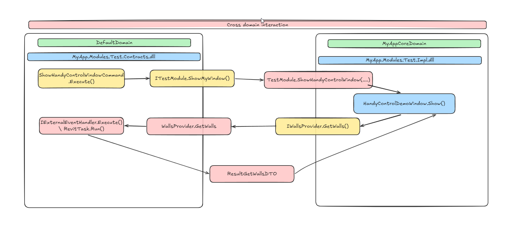

MarshalByRefObject как раз и нужен для того, чтобы объект из одного домена приложения можно было вызывать из другого. Это делается за счёт удалённого вызова через прокси, а не за счёт копирования объекта:
1. Объект остаётся в своём домене. WallsProvider создаётся и живёт в домене Revit. В другой домен (Core) он не копируется.
2. В другом домене даётся прокси. Когда ссылку на WallsProvider передают в домен Core, CLR создаёт в Core прозрачный прокси (transparent proxy). Этот прокси выглядит как тот же тип (например, IWallsProvider), но это не сам объект, а «заглушка».
3. Вызовы уходят через границу домена. Когда в Core вызывают, например, GetWalls() по этой ссылке:
	- вызов перехватывается прокси;
	- запрос сериализуется и передаётся в домен Revit (remoting / cross-domain call);
	- в домене Revit выполняется реальный WallsProvider.GetWalls();
	- результат (например, WallsViewModel) сериализуется и возвращается в Core.
4. Требования к типам при пересечении границы:
	- Параметры и возвращаемые значения методов должны быть сериализуемыми (или тоже MarshalByRefObject), иначе их нельзя передать между доменами.

Важно чтобы междоменное дто, такое как например WallsViewModel и WallItem  должны быть сериализуемы с помощью атрибута [Serializable], как это мы делали ранее.
Благодаря этому мы можем иметь двухсторонне общение между доменами, создавая некий бридж - контракт и находя реализацию для наших компонентов.

# Подключение модулей и домен менеджера к стартеру плагина

Теперь подключим наш домен менджер и модули к стартеру плагина, для того чтобы проверить работу приложения. 
Создаем стартап плагина (создание манифеста мы не будем рассматривать):
```c#
/// <summary>
/// Точка входа плагина Revit: инициализация домена Core, DI-контейнера и ленты с командами.
/// </summary>
public class MyAppExternalApplication : IExternalApplication
{
    private const string TabName = "MyApp";
    private const string PanelName = "Инструменты";
    private static readonly string CoreCommandsAssemblyPath = typeof(SampleOneExternalCommand).Assembly.Location;
    private static readonly string TestModuleCommandsAssemblyPath = typeof(ShowHandyControlWindowCommand).Assembly.Location;

    private static ServiceContainer? _container;

    /// <summary>
    /// Вызывается при завершении Revit: логирование, выгрузка домена Core, сброс контейнера.
    /// </summary>
    public Result OnShutdown(UIControlledApplication application)
    {
        try
        {
            var container = _container;
            if (container != null)
            {
                container.Resolve<ICoreModule>()?
                    .Container.Resolve<ILogger>()?
                    .Log("Revit плагин MyApp завершает работу");
            }
            OtherAppDomainManager.Shutdown();
        }
        finally
        {
            DIContainerContext.SetCurrent(null);
            _container?.Dispose();
            _container = null;
        }
        return Result.Succeeded;
    }

    /// <summary>
    /// Вызывается при запуске Revit: создание контейнера, инициализация домена Core, создание ленты, регистрация RevitTask.
    /// </summary>
    public Result OnStartup(UIControlledApplication application)
    {
        try
        {
            _container = new ServiceContainer();

            DIContainerContext.SetCurrent(_container);

            OtherAppDomainManager.Initialize(AppDomainManagerConfig.Default);

            var logger = _container.Resolve<ICoreModule>()?.Container.Resolve<ILogger>();
            if (logger == null)
            {
                TaskDialog.Show("MyApp", "Не удалось инициализировать логгер.");
                return Result.Failed;
            }

            logger.Log("Revit плагин MyApp запущен");

            CreateRibbon(application);

            logger.Log("Startup complete");

            var controller = _container.Resolve<ITestSampleModule>();
            controller?.ShowMaterialWindow();

            var revitTask = new RevitTask();

            _container.AddSingleton<RevitTask>(_ => revitTask);

            return Result.Succeeded;
        }
        catch (Exception ex)
        {
            TaskDialog.Show("Ribbon Sample", ex.ToString());
            return Result.Failed;
        }
    }

    /// <summary>
    /// Создаёт вкладку и панель ленты Revit с кнопками команд (данные, Material, Metro, HandyControl, Excel, Hello).
    /// </summary>
    private static void CreateRibbon(UIControlledApplication application)
    {
        application.CreateRibbonTab(TabName);
        var panel = application.CreateRibbonPanel(TabName, PanelName);

        var showWindowButton = new PushButtonData(
            "MyApp_ShowRandomDataWindow",
            "Открыть окно\nданных", 
            TestModuleCommandsAssemblyPath,
            typeof(ShowRandomDataWindowCommand).FullName!)
        {
            ToolTip = "Открыть окно со случайными данными (ViewModel из Core)"
        };
        panel.AddItem(showWindowButton);

        var materialButton = new PushButtonData(
            "MyApp_ShowMaterialWindow",
            "Material",
            TestModuleCommandsAssemblyPath,
            typeof(ShowMaterialWindowCommand).FullName!)
        {
            ToolTip = "Окно Material Design"
        };
        panel.AddItem(materialButton);

        var metroButton = new PushButtonData(
            "MyApp_ShowMetroWindow",
            "Metro",
            TestModuleCommandsAssemblyPath,
            typeof(ShowMetroWindowCommand).FullName!)
        {
            ToolTip = "Окно MahApps.Metro"
        };
        panel.AddItem(metroButton);

        var handyControlButton = new PushButtonData(
            "MyApp_ShowHandyControlWindow",
            "HandyControl",
            TestModuleCommandsAssemblyPath,
            typeof(ShowHandyControlWindowCommand).FullName!)
        {
            ToolTip = "Окно HandyControl"
        };
        panel.AddItem(handyControlButton);

        var excelButton = new PushButtonData(
            "MyApp_CreateTempExcelFile",
            "Excel",
            TestModuleCommandsAssemblyPath,
            typeof(CreateTempExcelFileCommand).FullName!)
        {
            ToolTip = "Создать случайный Excel рядом со сборкой"
        };
        panel.AddItem(excelButton);

        var helloButton = new PushButtonData(
            "MyApp_SampleOne",
            "Hello",
            CoreCommandsAssemblyPath,
            typeof(SampleOneExternalCommand).FullName!)
        {
            ToolTip = "Показать приветствие"
        };
        panel.AddItem(helloButton);
    }
}

```

Перед запуском установим несколько плагинов, с которыми возможен конфликт зависимостей ранее. 
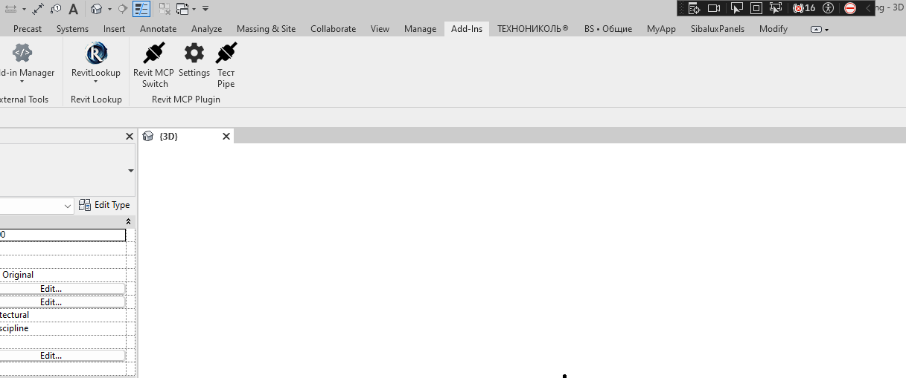

Панель и команды мы захардкодим, в будущем можно будет реализовать сервис для динамической загрузки конфига и интегрировать его с нашей модульной системой, добавить в нашу модульную систему регистрацию апдейтеров со сборок модулей. 

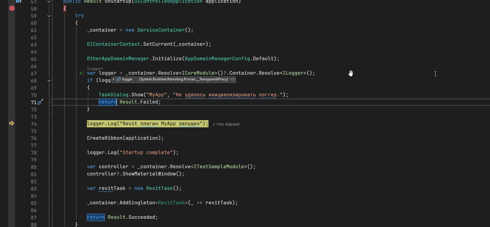
Логер иницилизируется без проблем, также мы можем получать доступ не только к контейнеру зависимости ядра, но и его модулей, при желании можно убрать зависимость от модуля и наш стартап может ничего не знать про модули, в нашем менеджере они загружаются и инициализируются с помощью рефлексии.
Попробуем в нашем стартапе вызвать даже wpf окно из Material UI kit (реализация которого вызывается из другого домена).
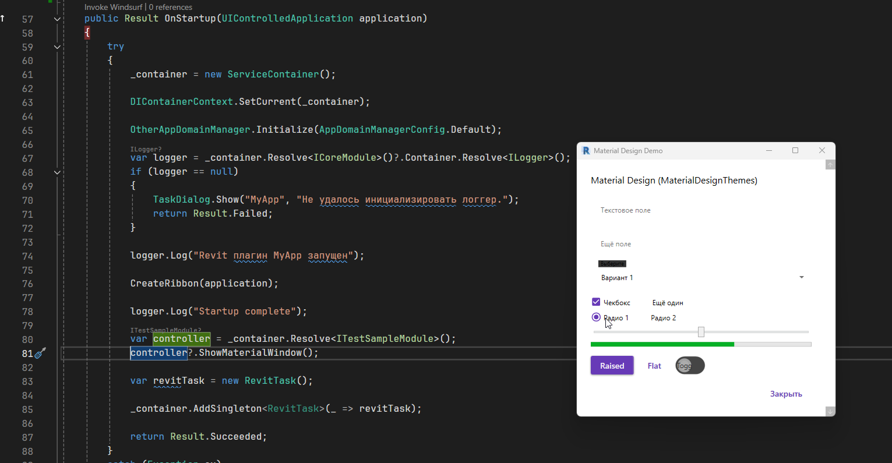
Окно открылось без проблем. Теперь попробуем запустить наши две команды. Удаление через окно с блокированием интерфейса Revit и с не блокированием:
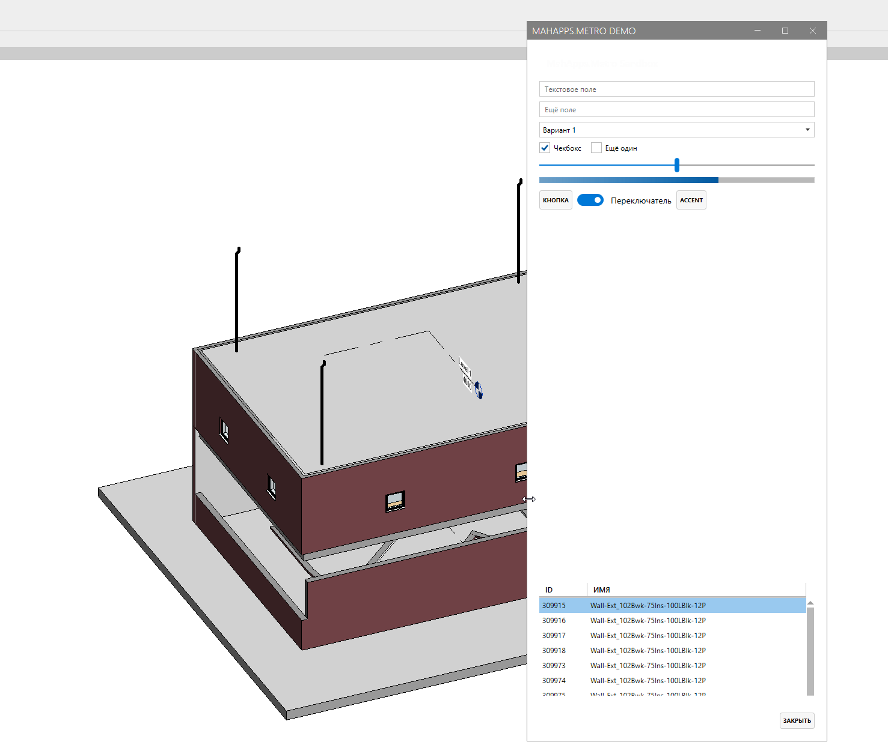
Мы выбрали элемент, окно заблокировало Revit и теперь закроем окно, чтобы произвести удаление.
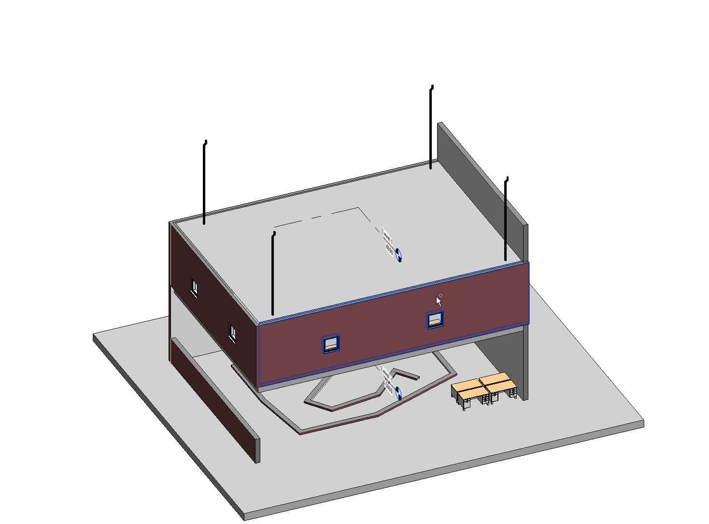
Теперь второй плагин. Запускаем и запрашиваем данные с нашего хендлера:
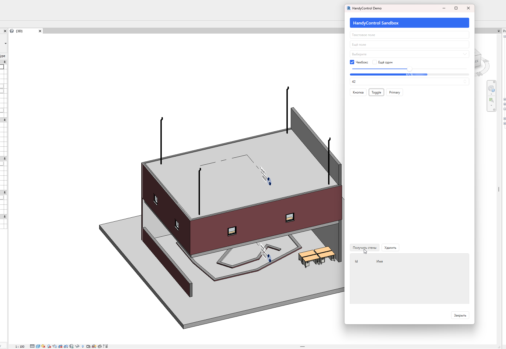
Запрашиваем элементы с модели. Выбираем элемент и Revit выделяет его у себя в BIM модели:
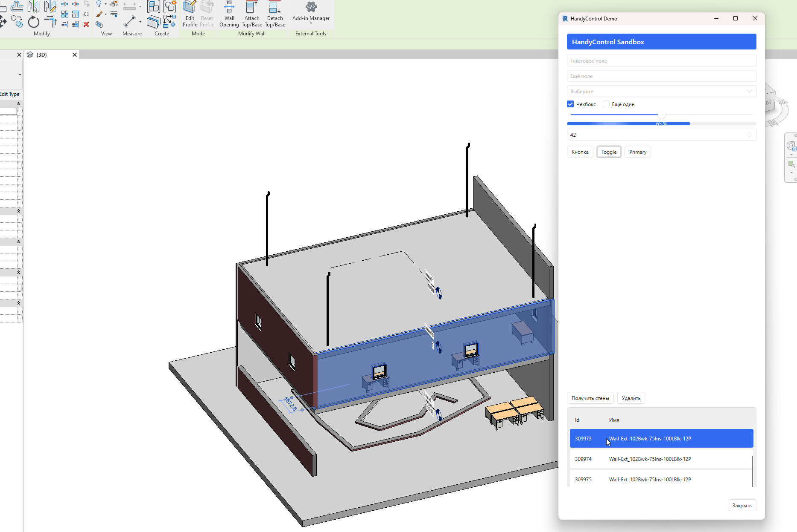
UI работает независимо. Теперь проверим удаление, оно может быть возможным только в контексте Revit и с транзакцией:
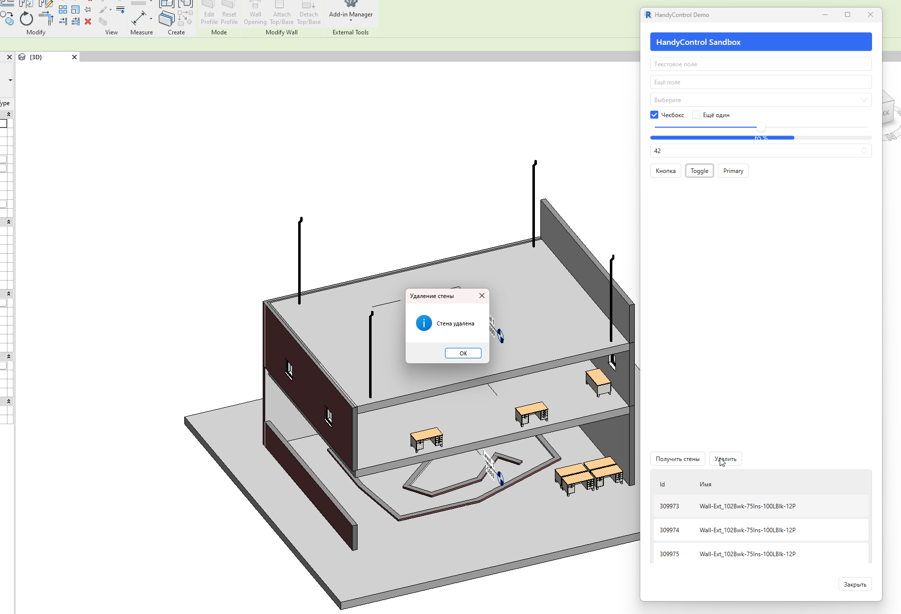
Также результат нам вернулся и  мы удалили тот элемент в памяти окна, который удалили в ревите - все почти бесшовно, как при обычном вызове кода. 

Также есть другие комманды, которые имеют свои зависимости и задачи, которые вы сможете посмотреть в репозитории.

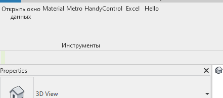

Там будут разные кейсы использования модулей и вариантов взаимодействия.

# Точки роста подхода и архитектуры

В дальнейшем можно убрать зависимость MyApp.Modules.Test.Impl\Contract у MyApp.Starter, оставив только модуль Core. Зависимость от TestModule  я оставил для наглядности - показать возможность вызова кода даже с другого модуля.

Можно сделать для модуля ядра функционал динамического создания кнопок и регистрации их команд в рантайме на основе конфига (наример json или веб провайдера).

Также добавить в модуль Core функционал для регистрации апдейтеров с других модулей.

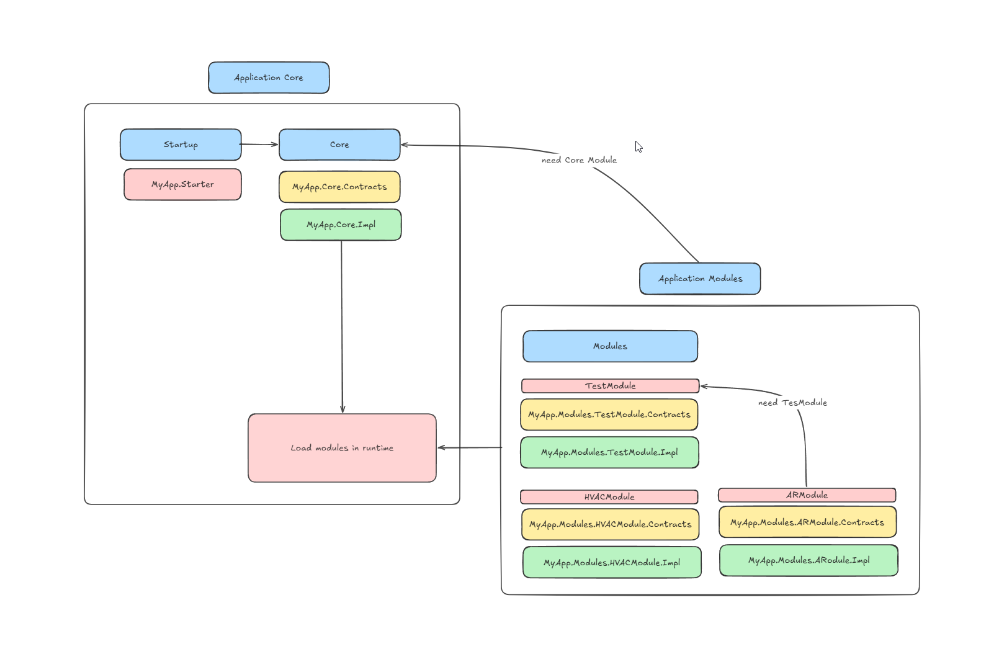

И тем самым мы получим возможность динамически подгружать модули, меняя сборки модулей понижая или увеличивая их версии, управление предоставить службе windows или десктопному приложению. 


# Заключение и рекомендации

Подход меняет архитектуру написания плагинов, добавляя слой абстракции (контрактов) для того чтобы можно было почти бесшовно (в отличии от клиент-серверной технологии проектов) писать плагины, что является несомненным плюсом - все работает в рамках одного процесса и на первый взгляд  мы получаем высокий уровень безопасности (в отличии от редактирования IL кода) - что все будет работать как при стандартном подключении зависимостей к .net 48 приложение.

Данный подход также не имеет проблем к реализации модульности для своего приложения, что является положительным фактором в масштабировании (создание дополнительных модулей и их подключение через рефлексию).

Однако стоит учитывать что трудозатраты на данную архитектуру с этим подходом требуют от разработчика больше знаний и умение писать код так чтобы делить "логику ревита" с "логикой другого домена".

А вот решать - использовать данный способ для решения конфликта зависимостей или нет - решать вам в зависимости от ваших НФТ и ФТ.

Надеюсь вам эта статья помогла. Удачи.  


   
   
   

